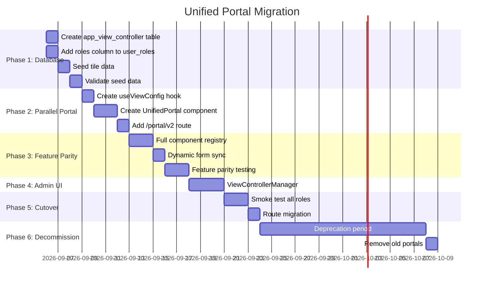

# Unified Portal via `app_view_controller` — Architecture & Migration Plan

## Problem Statement

The current system has **5 separate portal components** (`AdminPortal`, `ManagementPortal`, `RolePortal` for teacher, `RolePortal` for parent, `CandidatePortal`) with **hardcoded tile definitions** scattered across JSX files. Each portal duplicates tile-rendering logic, subview routing, and access control. This makes it:

- **Rigid**: Adding/removing/reordering a tile requires code changes and redeployment
- **Redundant**: Shared features (Syllabus Manager, Timetable Viewer, etc.) are duplicated across portals
- **Ungovernable**: No centralized visibility or access control

The solution is a **database-driven `app_view_controller`** table that defines every UI component (tile, subview, variable) with role-based access, enabling a **single unified portal** that dynamically renders tiles based on the user's roles.

---

## Current State Analysis

### Existing Portal Tiles Inventory

| Portal                     | Hardcoded Tiles                                                                                                                                                                                      | Shared Components                                                                                  |
| -------------------------- | ---------------------------------------------------------------------------------------------------------------------------------------------------------------------------------------------------- | -------------------------------------------------------------------------------------------------- |
| **Admin** (7 tiles)        | Employee Mgmt, Students Mgmt, Form Configs, Timetable Planner, Syllabus Manager, Lesson Planner & Tracker, TV Display                                                                                | SyllabusManager, SyllabusTrackerPortal, EmployeeRecordsView                                        |
| **Management** (12+ tiles) | Academic Calendar, Dashboard, Employee Mgmt, Students Mgmt, Complaints, Timetable Viewer, Lesson Planner, Syllabus Manager, Job Applications, Take Test, TV Display, Requests & Exceptions + dynamic | SyllabusManager, SyllabusTrackerPortal, TimetableAdminView, AdminStudentsView, EmployeeRecordsView |
| **Teacher** (8 tiles)      | Academic Calendar, Dashboard, View Timetable, Lesson Planner, Syllabus Manager, Students Record, Personal Info, My Tickets                                                                           | SyllabusManager, SyllabusTrackerPortal, TeacherTimetableViewer, TeacherStudentsViewer              |
| **Parent** (4 tiles)       | Academic Calendar, Class Schedule, My Tickets, Syllabus Progress                                                                                                                                     | ParentTimetableViewer, SyllabusTrackerPortal                                                       |
| **Candidate** (1 tile)     | Take Test                                                                                                                                                                                            | CandidatePortal                                                                                    |

### Existing Role System

- `user_roles` table: `user_id` (uuid PK), `role` (smallint — bitmask), `created_at`
- Bitmask values: Guest=1, Parent=2, Staff=4, Teacher=8, Management=16, Admin=32
- Role decode happens in [useAuth.js](file:///c:/Projects/jzv-ui/src/hooks/useAuth.js#L169-L197) on every login

---

## Database Changes

### 1. New Table: `app_view_controller`

```sql
CREATE TABLE app_view_controller (
  id                 bigint GENERATED BY DEFAULT AS IDENTITY PRIMARY KEY,
  component_name     text NOT NULL UNIQUE,
  component_type     text NOT NULL CHECK (component_type IN ('tile', 'component', 'subview', 'variable')),
  group_name         text,
  is_active          boolean NOT NULL DEFAULT true,
  default_access     text NOT NULL DEFAULT 'none',
  description        text,
  valid_access_roles text[] NOT NULL DEFAULT '{}',
  display_order      integer DEFAULT 0,
  created_at         timestamptz NOT NULL DEFAULT timezone('utc', now()),
  updated_at         timestamptz NOT NULL DEFAULT timezone('utc', now())
);
```

> [!NOTE]
> **UI metadata (icon, button_color, shadow_class, title, title_key, description_key, parent_component, config) is intentionally excluded** — these are maintained in code alongside the React component registry. Only access-control and visibility fields live in the database.

> [!IMPORTANT]
> **`component_type` values explained:**
>
> - `tile` — A clickable dashboard card that launches a subview (e.g., "Syllabus Manager", "Students Management")
> - `component` — A reusable UI component that can be embedded in multiple tiles/subviews
> - `subview` — The actual view that renders when a tile is clicked (maps to the React component)
> - `variable` — A config variable or feature flag (e.g., "enable_tv_display", "max_test_hours")

### 2. New Column on `user_roles`: `roles text[]`

Add a **generated column** that translates the bitmask `role` into a human-readable array:

```sql
ALTER TABLE user_roles
ADD COLUMN roles text[] GENERATED ALWAYS AS (
  ARRAY_REMOVE(ARRAY[
    CASE WHEN (role & 1)  != 0 THEN 'guest'      END,
    CASE WHEN (role & 2)  != 0 THEN 'parent'     END,
    CASE WHEN (role & 4)  != 0 THEN 'staff'      END,
    CASE WHEN (role & 8)  != 0 THEN 'teacher'    END,
    CASE WHEN (role & 16) != 0 THEN 'management' END,
    CASE WHEN (role & 32) != 0 THEN 'admin'      END
  ], NULL)
) STORED;
```

> [!NOTE]
> This is a **generated stored column** — it auto-updates whenever `role` changes. No application code changes needed to maintain it. The `admin_users_view` will automatically pick it up.

### 3. RLS Policies for `app_view_controller`

```sql
-- Everyone can read active configs (needed on app load)
ALTER TABLE app_view_controller ENABLE ROW LEVEL SECURITY;

CREATE POLICY "Anyone can read active view configs"
  ON app_view_controller FOR SELECT
  USING (is_active = true);

-- Only admin can modify
CREATE POLICY "Admin can manage view configs"
  ON app_view_controller FOR ALL
  TO authenticated
  USING (has_role_above(32))
  WITH CHECK (has_role_above(32));
```

---

## Open Questions

> [!IMPORTANT]
> **Q1: Generated column vs trigger for `roles text[]`?**
> A generated stored column is cleaner and zero-maintenance, but it means the column is read-only (cannot be set directly). Since the bitmask `role` is the source of truth, this should be fine. **Do you agree with the generated column approach?**

> [!IMPORTANT]
> **Q2: Should the `admin_users_view` be updated to include the new `roles` column?**
> Currently the view only exposes `role` (the bitmask). Adding `roles` (the text array) to the view would let the frontend read roles from the view directly without decoding. This would simplify `useAuth.js`.

> [!IMPORTANT]
> **Q3: Phase 2 parallel portal — should it be a new route (e.g., `/portal/v2`) or a feature flag toggle on the existing `/portal/:role` routes?**
> A new route would be safest for parallel operation. A feature flag would be less disruptive but riskier.

> [!IMPORTANT]
> **Q4: TV Display Board opens a new window (`window.open`). Should it be registered as a `tile` type in `app_view_controller` with a special `config.action = 'open_window'` or kept as an exception?**

---

## Phased Execution Plan

---

### Phase 1 — Database Foundation

**Goal**: Create the new table, add the roles column, seed initial data

#### Task 1.1: Create `app_view_controller` table

- Write and execute the `CREATE TABLE` SQL
- Add RLS policies (read for all authenticated, write for admin only)
- Add a trigger for `updated_at` auto-update

#### Task 1.2: Add `roles text[]` generated column to `user_roles`

- Execute the `ALTER TABLE` SQL
- Verify the column auto-populates for existing rows
- Update `admin_users_view` to include the new `roles` column

#### Task 1.3: Seed `app_view_controller` with current tile/component inventory

- Map all 32+ hardcoded tiles from all portals into INSERT statements
- Set `valid_access_roles` based on current portal visibility
- Set `display_order` to match current tile ordering
- Capture `icon`, `button_color`, `shadow_class`, `title`, `description` from existing JSX

**Seed data example (partial):**

| component_name              | type | group      | valid_access_roles                     | title                    |
| --------------------------- | ---- | ---------- | -------------------------------------- | ------------------------ |
| `employee-management`       | tile | admin-core | `{admin, management}`                  | Employee Management      |
| `student-records`           | tile | admin-core | `{admin, management}`                  | Students Management      |
| `form-configurations`       | tile | admin-only | `{admin}`                              | Form Configurations      |
| `timetable-planner`         | tile | timetable  | `{admin}`                              | Timetable Planner        |
| `timetable-viewer`          | tile | timetable  | `{management, teacher}`                | Timetable Viewer         |
| `syllabus-manager`          | tile | syllabus   | `{admin, management, teacher}`         | Syllabus Manager         |
| `syllabus-progress-tracker` | tile | syllabus   | `{admin, management, teacher, parent}` | Lesson Planner & Tracker |
| `academic-calendar`         | tile | calendar   | `{management, teacher, parent}`        | Academic Calendar        |
| `dashboard`                 | tile | dashboard  | `{management, teacher}`                | Dashboard                |
| `personal-info`             | tile | employee   | `{teacher}`                            | Personal Info            |
| `my-tickets`                | tile | tickets    | `{teacher, parent}`                    | My Tickets               |
| `registered-complaints`     | tile | complaints | `{management}`                         | Registered Complaints    |
| `job-applications`          | tile | hr         | `{management}`                         | Job Applications         |
| `take-test`                 | tile | testing    | `{management, candidate}`              | Take Test                |
| `tv-display`                | tile | display    | `{admin, management}`                  | TV Display Board         |
| `requests-exceptions`       | tile | approvals  | `{management}`                         | Requests & Exceptions    |
| `class-schedule`            | tile | timetable  | `{parent}`                             | Class Schedule           |
| `syllabus-progress`         | tile | syllabus   | `{parent}`                             | Syllabus Progress        |

#### Task 1.4: Validate seed data

- Query `app_view_controller` and verify all tiles are present
- Cross-reference against current portal tile lists
- Verify `valid_access_roles` matches current behavior
- Refresh the database schema cache

**Deliverable**: SQL migration file in `/debug-files/execute-query.sql`

---

### Phase 2 — Frontend Hook & Parallel Portal

**Goal**: Build the data-fetching layer and a parallel "unified portal" route that coexists with existing portals

#### Task 2.1: Create `useViewConfig` hook

- New hook: `src/hooks/useViewConfig.js`
- On app load, fetch `app_view_controller` where `is_active = true`
- Filter tiles by user's roles: `valid_access_roles && userRoles` overlap check
- Cache in module-level variable (same pattern as SyllabusTracker cache)
- Expose: `getVisibleTiles(userRoles)`, `getVisibleComponents(userRoles)`, `isFeatureEnabled(name, userRoles)`, `loading`

```js
// Pseudocode
const useViewConfig = (userRoles) => {
  const [viewConfig, setViewConfig] = useState([]);

  useEffect(() => {
    supabase
      .from('app_view_controller')
      .select('*')
      .eq('is_active', true)
      .order('display_order')
      .then(({ data }) => setViewConfig(data));
  }, []);

  const getVisibleTiles = () =>
    viewConfig.filter(
      (v) => v.component_type === 'tile' && v.valid_access_roles.some((r) => userRoles.includes(r))
    );

  return { viewConfig, getVisibleTiles, loading };
};
```

#### Task 2.2: Create `UnifiedPortal` component

- New component: `src/components/auth/UnifiedPortal.jsx`
- Receives `userRoles`, `user`, `fullName`, `teacherRecord` from `App.jsx`
- Uses `useViewConfig` to dynamically render tiles
- Maps `component_name` to lazy-loaded React components via a registry
- Handles subview state internally

**Component Registry pattern:**

```js
const COMPONENT_REGISTRY = {
  'employee-management': () => <EmployeeRecordsView role="admin" />,
  'student-records': () => <AdminStudentsView />,
  'syllabus-manager': (props) => <SyllabusManager role={props.role} />,
  'timetable-planner': () => <TimetableManager />,
  // ... all subview components mapped here
};
```

#### Task 2.3: Add parallel route `/portal/v2`

- Add route in [AppRoutes.jsx](file:///c:/Projects/jzv-ui/src/components/AppRoutes.jsx)
- Protected by authentication (any authenticated user)
- Renders `UnifiedPortal`
- **Existing routes remain untouched** — both old and new portals work simultaneously

#### Task 2.4: Update `admin_users_view` to include `roles` array

- Modify the view to include the new `roles text[]` column from `user_roles`
- Optionally simplify `useAuth.js` to read roles directly from the view instead of decoding bitmask client-side

**Deliverables**:

- `src/hooks/useViewConfig.js`
- `src/components/auth/UnifiedPortal.jsx`
- Updated `AppRoutes.jsx` with `/portal/v2` route

---

### Phase 3 — Component Consolidation & Feature Parity

**Goal**: Ensure the unified portal renders every feature from every old portal

#### Task 3.1: Build the full component registry

- Map every subview component used across all 5 portals
- Handle role-specific props (e.g., `SyllabusManager` receives `role="teacher"` vs `role="admin"`)
- Use the `config` jsonb column in `app_view_controller` to pass role-specific configuration

#### Task 3.2: Migrate dynamic form tiles

- Currently `dynamic_form_configs.form_visibility` drives dynamic tiles in `AppRoutes.jsx` and `ManagementPortal.jsx`
- Create a sync mechanism: when a `dynamic_form_config` is created/updated, auto-create/update a corresponding `app_view_controller` entry with `component_type = 'tile'` and `group = 'dynamic-form'`
- Or: query both tables in `useViewConfig` and merge them

#### Task 3.3: Handle special tile actions

- TV Display Board: `config.action = 'open_window'`, `config.url = '/portal/display'`
- Requests & Exceptions: `config.action = 'open_modal'`
- These actions are handled in the `UnifiedPortal` tile click handler

#### Task 3.4: Feature parity testing

- Manual verification of each tile/subview in `/portal/v2` against the old portals
- Create a checklist comparing old vs new for each role

**Deliverables**:

- Complete component registry
- Dynamic form sync
- Feature parity checklist

---

### Phase 4 — Admin UI for `app_view_controller`

**Goal**: Allow admins to manage tile visibility, ordering, and access roles from the UI

#### Task 4.1: Create `ViewControllerManager` component

- New admin subview accessible from the Admin portal
- CRUD for `app_view_controller` entries
- Drag-and-drop reordering (updates `display_order`)
- Toggle `is_active` for instant hide/show
- Multi-select for `valid_access_roles`
- Preview of how tiles appear for each role

#### Task 4.2: Register the manager as a tile

- Add `view-controller-manager` to `app_view_controller` with `valid_access_roles = {admin}`
- Also add to the existing AdminPortal tiles (for Phase 4 parallel operation)

**Deliverables**:

- `src/components/admin-settings/ViewControllerManager.jsx`
- Admin UI for tile management

---

### Phase 5 — Validation & Cutover ✅ COMPLETED

**Goal**: Redirect old portal routes to the unified portal

#### Task 5.1: Smoke test all roles ✅

- Verified all role views (admin, management, teacher, parent, candidate) render permitted tiles dynamically
- Subview switching, modal triggering, and external links working cleanly
- RLS permissions modernized with `has_any_role` and `roles text[]`

#### Task 5.2: Route migration ✅

- All legacy portal routes (`/portal/admin`, `/portal/management`, `/portal/parent`, `/portal/teacher`, `/portal/candidate`) automatically redirect to `/portal`
- Post-login navigation redirected directly to `/portal`
- Direct deep links (`/portal/v2`) supported as alias
- "My Portal" card click navigates directly to `/portal`

#### Task 5.3: Update `useAuth.js` role handling ✅

- Queries `admin_users_view` selecting both `role` and `roles`
- Direct decode of `roles text[]` with fallback to bitmask integer decode

**Deliverables**:

- Route redirects in `AppRoutes.jsx`
- Unified navigation in `App.jsx` and `LoginPortal.jsx`
- Verified clean build (`npm run build` passed)

---

### Phase 6 — Decommission Old Portals [COMPLETED]

**Goal**: Remove legacy portal code after validation period

- [x] Deleted `AdminPortal.jsx`
- [x] Deleted `ManagementPortal.jsx` (~61KB code reduction)
- [x] Deleted `CandidatePortal.jsx`
- [x] Deleted `RolePortal.jsx`
- [x] Deleted `RoleSelectionDashboard.jsx`
- [x] Removed legacy routes from `AppRoutes.jsx`
- [x] Removed unused portal subview states from `App.jsx` (`adminSubView`, `managementSubView`, `teacherSubView`, `parentSubView`, `candidateSubView`)
- [x] Removed fallback configurations from `tileRegistry.js` and `useViewConfig.js`
- [x] Updated architecture and navigation documentation in `context.md`

**Deliverables**:

- [x] Deleted legacy files
- [x] Clean `AppRoutes.jsx`
- [x] Simplified `App.jsx`
- [x] Updated documentation

---

## Verification Plan

### Automated Tests

- Query `app_view_controller` to verify all tiles exist and have correct `valid_access_roles`
- Verify `user_roles.roles` generated column matches bitmask decode for all existing users
- Verify RLS: non-admin cannot INSERT/UPDATE/DELETE `app_view_controller`

### Manual Verification

- Login as each role → verify correct tiles appear
- Click each tile → verify subview renders correctly
- Toggle `is_active` in database → verify tile disappears immediately on refresh
- Change `valid_access_roles` → verify access changes immediately
- Verify parallel operation: old portals and new portal work simultaneously during Phase 2-4

---

## Estimated Impact

| Metric             | Before                       | After                                 |
| ------------------ | ---------------------------- | ------------------------------------- |
| Portal JSX files   | 5 files, ~85KB total         | 1 file, ~15KB                         |
| Tile definitions   | 32+ hardcoded across 4 files | 1 database table                      |
| Adding a new tile  | Code change + deploy         | Database INSERT                       |
| Hiding a tile      | Code change + deploy         | `UPDATE SET is_active = false`        |
| Role access change | Code change + deploy         | `UPDATE SET valid_access_roles = ...` |
| Reordering tiles   | Code change + deploy         | `UPDATE SET display_order = ...`      |

---

## Execution Sequence



---

## Execution Status Tracker

| Phase       | Description                              | Status           | Deliverables / Notes                                                                                                                                                                                            |
| ----------- | ---------------------------------------- | ---------------- | --------------------------------------------------------------------------------------------------------------------------------------------------------------------------------------------------------------- |
| **Phase 1** | Database Foundation                      | ✅ Verified Live | `app_view_controller` active with 20 seed rows; `roles text[]` generated column active and tested in live Supabase                                                                                              |
| **Phase 2** | Parallel Portal (`/portal/v2`)           | ✅ Completed     | `useViewConfig.js`, `tileRegistry.js`, `UnifiedPortal.jsx`, parallel route `/portal/v2` in `AppRoutes.jsx`, `useAuth.js` update. Build verified clean                                                           |
| **Phase 3** | Component Consolidation & Feature Parity | ✅ Completed     | Full component registry with 100% parity across all 5 roles, modal openers, external links, dynamic form cache synchronization                                                                                  |
| **Phase 4** | Admin UI for `app_view_controller`       | ✅ Completed     | `ViewControllerManager.jsx` with instant in-place active toggle, role chip toggling, live Role Simulator preview, display re-ordering, create/edit/delete modals. Integrated into UnifiedPortal and AdminPortal |
| **Phase 5** | Validation & Cutover                     | ⏳ Ready         | Smoke testing all roles, role selection redirects to `/portal/v2`                                                                                                                                               |
| **Phase 6** | Decommission Old Portals                 | ⏳ Pending       | Clean up legacy portal files after deprecation                                                                                                                                                                  |
